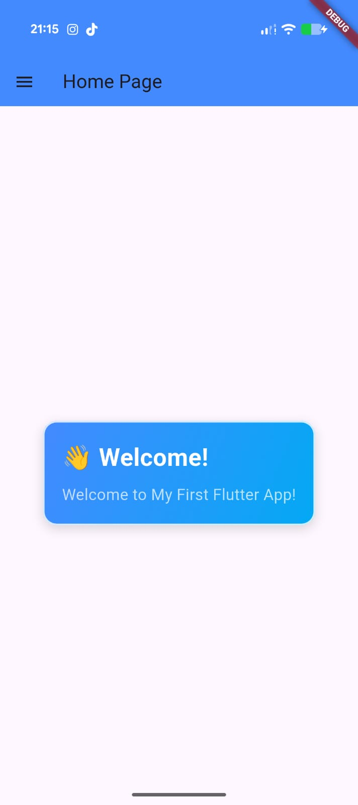
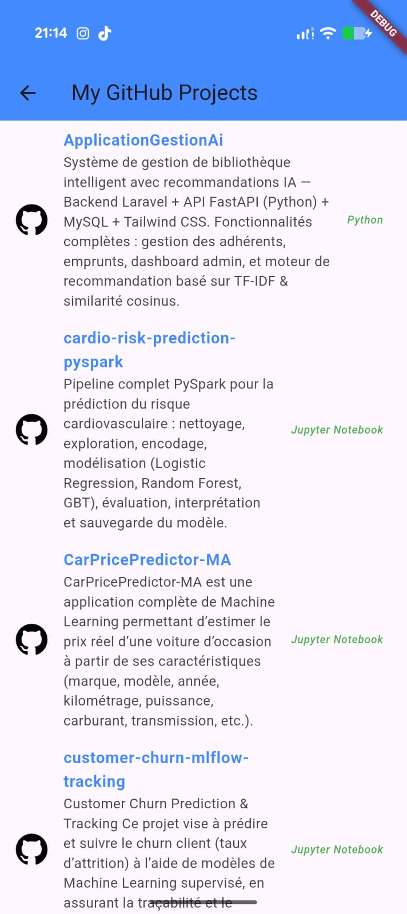
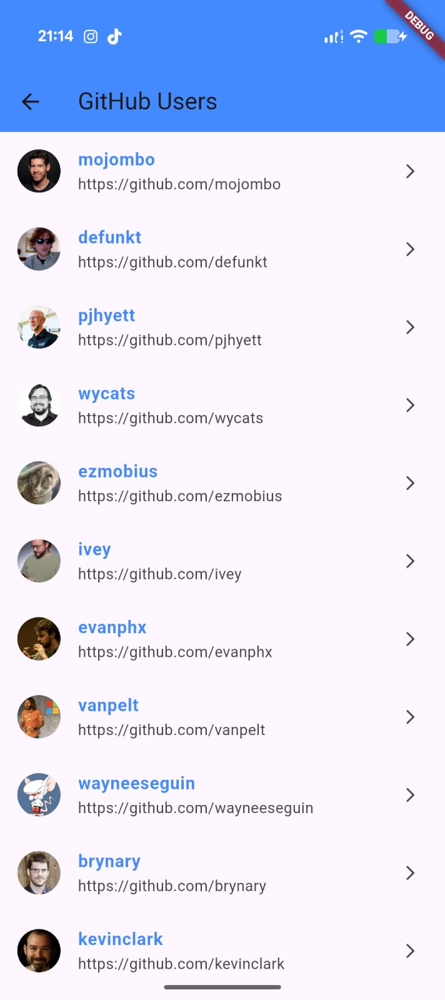
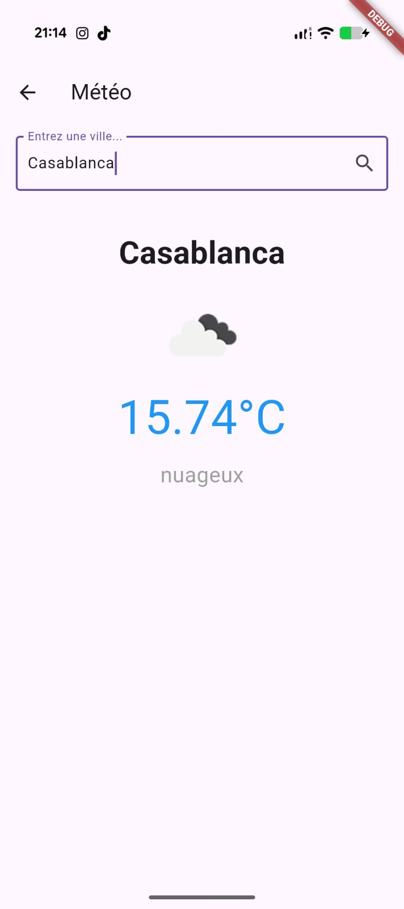
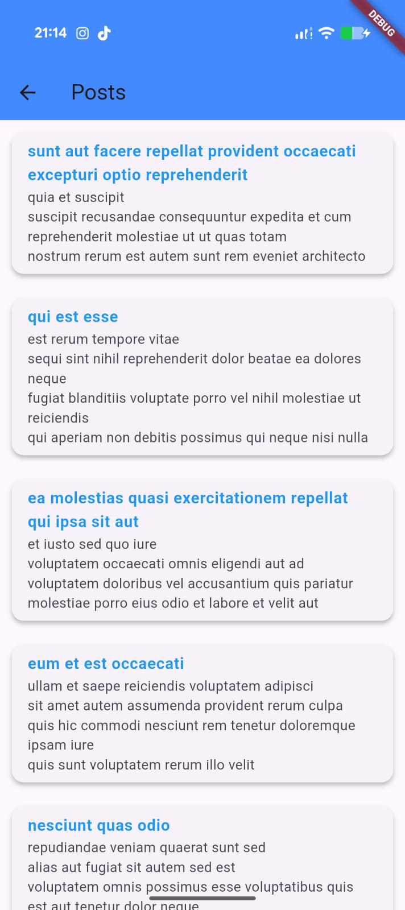
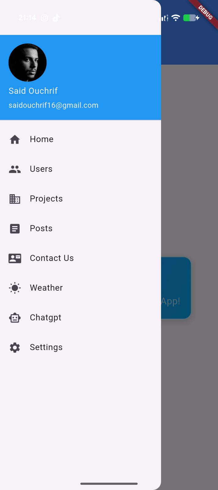
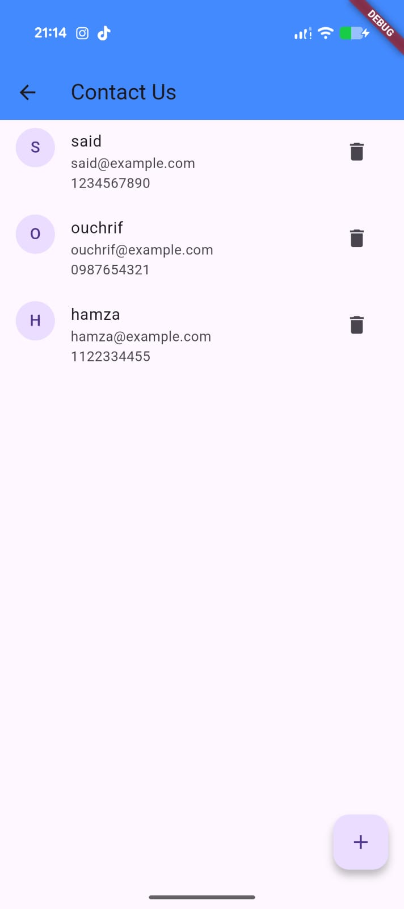
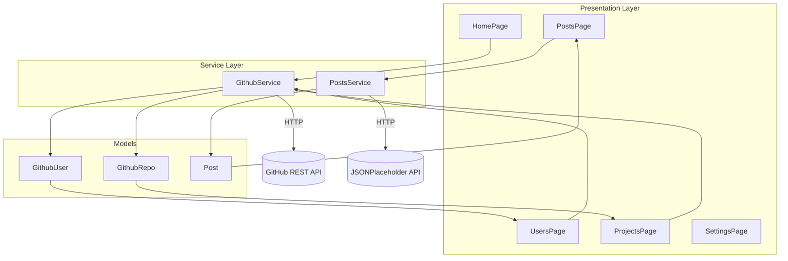
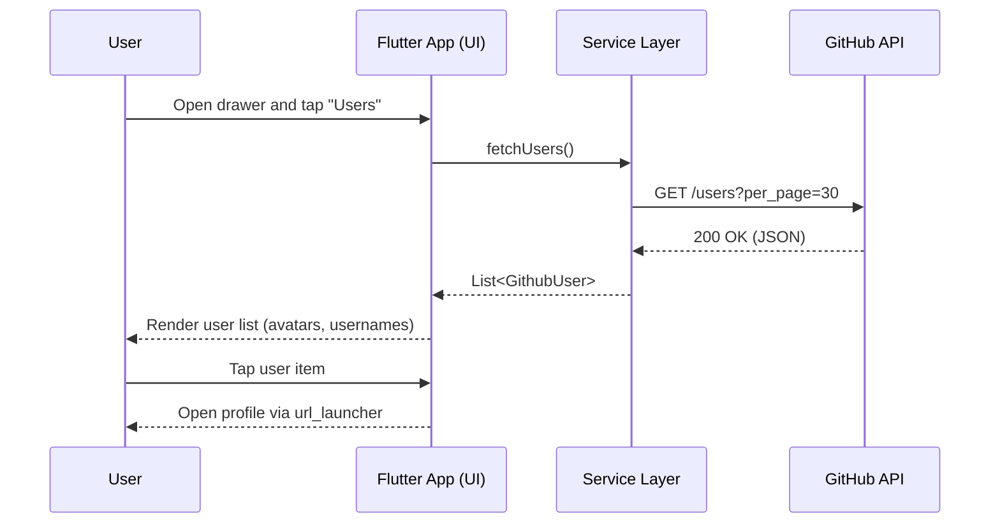
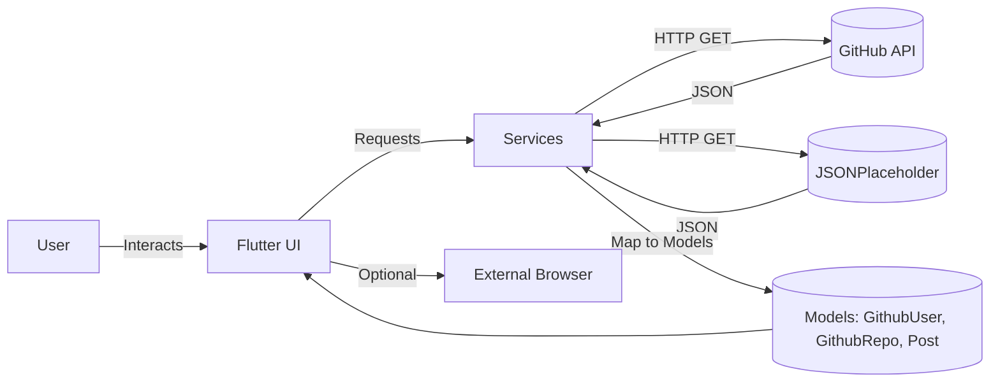

# 🚀 GitHub Explorer App (Flutter) ✨

Explore GitHub users and repositories with a clean Flutter interface, and experiment with REST calls using JSONPlaceholder. Multi-platform by default: Android, iOS, Web, Windows, macOS, and Linux.

---

## 📱 App Screenshots

<div align="center">

### 📸 Application Gallery

| Home Screen | Projects List | Users List | Meteo |
|-------------|------------|---------------|--------------|
|  |  |  |  |

| Posts Screen | Navigation Drawer | Chat IA | Contact |
|-----------------|-------------|----------------|-------------------|
|  |  |  |  |

</div>

---

## 📚 Table of Contents
- **Overview**
- **App Screenshots**
- **Key Features**
- **Tech Stack**
- **Project Structure**
- **Screens & Functionality**
- **APIs Used**
- **Getting Started**
- **Configuration**
- **Future Improvements**
- **Diagrams (Mermaid)**
- **License**

---

## 🧭 Overview

GitHub Explorer App is a comprehensive Flutter application that demonstrates practical API integration, modern UI patterns, and mobile development best practices:

### 🎯 **Core Functionality**
- **GitHub Integration**: Browse public GitHub users and their repositories
- **REST API Exploration**: Experiment with JSONPlaceholder for posts data
- **Contact Management**: Demo CRUD operations with contact forms
- **Multi-Platform Support**: Seamless experience across Android, iOS, Web, Desktop

### 🏗️ **Architecture Highlights**
- **Clean Architecture**: Organized with maintainable structure (Pages → Services → Models)
- **Modern Networking**: Uses `http` package for REST API calls
- **External Integration**: `url_launcher` for opening external links and profiles
- **Material Design**: Clean, intuitive UI following Google's design principles

### 📱 **User Experience**
- **Intuitive Navigation**: Drawer-based navigation with clear visual hierarchy
- **Responsive Design**: Adapts beautifully to different screen sizes
- **Smooth Interactions**: Thoughtful animations and transitions
- **Error Handling**: Graceful handling of network errors and edge cases

---

## 🔑 Key Features

### 🏠 **Home Screen**
- **Welcome Experience**: Elegant welcome card with gradient styling
- **Navigation Hub**: Intuitive drawer navigation to all main sections
- **Quick Access**: Easy access to Users, Projects, Posts, Contact, and Settings

### 📦 **Projects Screen**
- **Repository Browser**: Fetches repositories for any GitHub username
- **Rich Information**: Displays repo name, description, primary language
- **Visual Indicators**: GitHub icons and language badges
- **Configurable**: Default username: `saidouchrif` (easily customizable)

### 👤 **Users Screen**
- **User Discovery**: Browse public GitHub users (30 per page)
- **Profile Integration**: One-tap opening of user profiles in system browser
- **Avatar Display**: Visual user representation with profile pictures
- **Smooth Scrolling**: Optimized list performance

### 📰 **Posts Screen**
- **Content Management**: Fetch and display posts from JSONPlaceholder API
- **Card-Based UI**: Clean, modern card layout for posts
- **Title & Body**: Clear separation of post titles and content
- **API Demonstration**: Shows practical REST API integration

### 👥 **Contact Management**
- **Add Contacts**: Form-based contact creation with validation
- **Edit Contacts**: Update existing contact information
- **CRUD Operations**: Complete Create, Read, Update, Delete demo
- **Form Handling**: Proper form validation and user feedback

### ⚙️ **Settings Screen**
- **UI Preferences**: Dark mode and language selection toggles
- **About Dialog**: App information and version details
- **Cache Management**: Demo "Clear Cache" functionality with snackbar feedback
- **User Preferences**: Customizable app behavior settings

### 🌐 **Multi-Platform Support**
- **Cross-Platform**: Single codebase for Android, iOS, Web, Windows, macOS, Linux
- **Responsive Design**: Adaptive UI for different screen sizes and orientations
- **Native Performance**: Optimized performance across all platforms

---

## 🧰 Tech Stack

| Layer | Tools / Packages | Version |
| --- | --- | --- |
| **Framework** | Flutter 3 (Material Design) | Latest |
| **Language** | Dart | `^3.8.1` |
| **Networking** | `http` | `^1.2.0` |
| **URL Launching** | `url_launcher` | `^6.2.6` |
| **Icons** | `cupertino_icons` | `^1.0.8` |
| **Testing** | `flutter_test` | Built-in |
| **Linting** | `flutter_lints` | `^5.0.0` |
| **External APIs** | GitHub REST API v3, JSONPlaceholder | - |
| **Platforms** | Android, iOS, Web, Windows, macOS, Linux | - |

### 🔧 **Development Environment**
- **IDE Support**: Compatible with Android Studio, VS Code, IntelliJ IDEA
- **Hot Reload**: Instant UI updates during development
- **Debugging**: Comprehensive debugging tools and inspector
- **Testing**: Unit, widget, and integration testing support

---

## 🗂️ Project Structure

```text
github_api_flutter_app/
├─ lib/
│  ├─ main.dart
│  ├─ models/
│  │  ├─ github_repo.dart
│  │  ├─ github_user.dart
│  │  └─ post.dart
│  ├─ services/
│  │  ├─ github_service.dart        # GitHub API calls (users, repos)
│  │  └─ posts_service.dart         # JSONPlaceholder posts
│  └─ pages/
│     ├─ Home/
│     │  └─ home_page.dart
│     ├─ Projects/
│     │  └─ project_page.dart
│     ├─ Users/
│     │  └─ users_page.dart
│     ├─ Posts/
│     │  └─ posts_page.dart
│     ├─ Settings/
│     │  └─ settings_page.dart
│     └─ Contact/                   # optional demo screens
│        ├─ contact_page.dart
│        ├─ contact_add.dart
│        └─ cantact_update.dart
├─ images/
│  └─ profile.png                   # used in drawer avatar
├─ pubspec.yaml                      # deps and assets
└─ test/                             # tests (placeholder)
```

---

## 📱 Screens & Functionality

### 🏠 **Home Screen**
- **Purpose**: Central hub for app navigation and user onboarding
- **Features**: Welcome card with gradient design, navigation drawer access
- **Implementation**: `lib/pages/Home/home_page.dart`
- **Navigation Links**: Users, Projects, Posts, Contact (Add/Update), Settings

### 📦 **Projects Screen**
- **Purpose**: Display GitHub repositories for a specified user
- **Features**: Repository cards with name, description, language badges
- **API Integration**: `GithubService.fetchUserRepos(username)`
- **Default User**: `saidouchrif` (configurable in `initState()`)
- **Implementation**: `lib/pages/Projects/project_page.dart`

### 👤 **Users Screen**
- **Purpose**: Browse and interact with GitHub users
- **Features**: User list with avatars, usernames, profile links
- **API Integration**: GitHub API `/users?per_page=30`
- **External Integration**: `url_launcher` for profile opening
- **Implementation**: `lib/pages/Users/users_page.dart`

### 📰 **Posts Screen**
- **Purpose**: Demonstrate REST API consumption
- **Features**: Card-based post display with title and body
- **API Integration**: JSONPlaceholder `/posts` endpoint
- **Implementation**: `lib/pages/Posts/posts_page.dart`

### 👥 **Contact Management Screens**
- **Contact List**: `lib/pages/Contact/contact_page.dart`
- **Add Contact**: `lib/pages/Contact/contact_add.dart`
- **Update Contact**: `lib/pages/Contact/cantact_update.dart`
- **Features**: Form validation, CRUD operations demonstration

### ⚙️ **Settings Screen**
- **Purpose**: App preferences and information
- **Features**: Dark mode toggle, language selection, about dialog
- **Demo Features**: Clear cache with snackbar feedback
- **Implementation**: `lib/pages/Settings/settings_page.dart`

---

## 🌐 APIs Used

### 🐙 **GitHub REST API v3**
- **Base URL**: `https://api.github.com`
- **Version**: `2022-11-28`
- **Authentication**: Unauthenticated (rate limited to 60 requests/hour)

#### **Endpoints Used**
```http
# Get public users
GET /users?per_page=30
Headers: Accept: application/vnd.github+json, X-GitHub-Api-Version: 2022-11-28

# Get user repositories
GET /users/{username}/repos
Headers: Accept: application/vnd.github+json, X-GitHub-Api-Version: 2022-11-28
```

#### **Rate Limiting**
- **Unauthenticated**: 60 requests/hour per IP
- **Authenticated**: 5,000 requests/hour (with personal access token)
- **Implementation**: Basic error handling for rate limits

### 📝 **JSONPlaceholder**
- **Base URL**: `https://jsonplaceholder.typicode.com`
- **Purpose**: Free fake REST API for testing and prototyping
- **Data**: Mock posts, users, comments, todos

#### **Endpoints Used**
```http
# Get all posts
GET /posts
Response: Array of post objects with id, title, body, userId
```

### 🔧 **Service Implementation**
- **GitHub Service**: `lib/services/github_service.dart`
- **Posts Service**: `lib/services/posts_service.dart`
- **Error Handling**: Network exceptions, HTTP status codes
- **Data Models**: Strongly typed Dart models for API responses

---

## 🚀 Getting Started

### 📋 **Prerequisites**
- **Flutter SDK**: Version 3.0 or higher installed and configured
- **Dart SDK**: Version 3.8.1 or higher (included with Flutter)
- **Development Environment**: 
  - Android Studio / VS Code / IntelliJ IDEA
  - OR command-line with preferred editor
- **Target Platform**: 
  - Android device/emulator with API level 21+
  - iOS simulator/device (macOS only)
  - Web browser (Chrome, Firefox, Safari, Edge)
  - Desktop (Windows, macOS, Linux)

### 🔧 **Installation**

#### **1. Clone the Repository**
```bash
# Using HTTPS
git clone https://github.com/<your-username>/github_api_flutter_app.git

# Or using SSH (if configured)
git clone git@github.com:<your-username>/github_api_flutter_app.git
```

#### **2. Navigate to Project**
```bash
cd github_api_flutter_app
```

#### **3. Install Dependencies**
```bash
# Fetch Flutter dependencies
flutter pub get

# Verify installation
flutter doctor
```

#### **4. Verify Setup**
```bash
# Check that everything is configured
flutter doctor -v

# List available devices
flutter devices
```

### 🏃 **Running the Application**

#### **Quick Start**
```bash
# Run on the best available device
flutter run
```

#### **Platform-Specific Commands**
```bash
# Android
flutter run -d android

# iOS (macOS only)
flutter run -d ios

# Web
flutter run -d chrome
flutter run -d web-server    # For other browsers

# Desktop
flutter run -d windows      # Windows
flutter run -d macos        # macOS
flutter run -d linux        # Linux
```

#### **Development Features**
```bash
# Hot reload (while app is running)
# Press 'r' in terminal or use IDE hot reload

# Hot restart (full app restart)
# Press 'R' in terminal or use IDE hot restart

# Debug mode
flutter run --debug

# Profile mode (for performance testing)
flutter run --profile

# Release mode
flutter run --release
```

---

## ⚙️ Configuration

### 🔧 **Custom GitHub Username**
Change the default GitHub username used on the Projects screen:

**File**: `lib/pages/Projects/project_page.dart`  
**Location**: Inside `initState()` method

```dart
@override
void initState() {
  super.initState();
  _futureRepos = _githubService.fetchUserRepos('<your-github-username>');
}
```

### 🎨 **Customization Options**

#### **App Icon and Assets**
- **Profile Avatar**: Replace `images/profile.png` for drawer avatar
- **App Icon**: Update platform-specific icons in respective directories
- **Splash Screen**: Add splash screen images per platform requirements

#### **API Configuration**
- **GitHub Token**: Add authentication for higher rate limits
- **Base URLs**: Modify API endpoints in service files
- **Timeout Settings**: Adjust network timeout durations

#### **UI Customization**
- **Theme Colors**: Modify `MaterialApp` theme in `main.dart`
- **Fonts**: Add custom fonts to `pubspec.yaml` and use in UI
- **Icons**: Replace with custom icon sets if desired

### 🌍 **Environment Configuration**
Create environment-specific configurations:

```dart
// Example: Environment-based API URLs
const String githubApiBase = kDebugMode 
  ? 'https://api.github.com'  // Production
  : 'https://api.github.com'; // Same for demo
```

### 📱 **Platform-Specific Settings**

#### **Android Configuration**
- **Minimum SDK**: Defined in `android/app/build.gradle`
- **Permissions**: Add internet permission if needed
- **App Name**: Update in `android/app/src/main/AndroidManifest.xml`

#### **iOS Configuration**
- **Deployment Target**: Set in `ios/Runner.xcodeproj`
- **Info.plist**: Configure app permissions and settings
- **App Name**: Update in Xcode project settings

#### **Web Configuration**
- **Web Index**: Customize `web/index.html`
- **Favicon**: Replace with custom favicon
- **Manifest**: Update `web/manifest.json` for PWA features

---

## 🧭 Diagrams (Mermaid)

### 1) Architecture Diagram


### 2) Workflow Diagram


### 3) Data Flow Diagram (DFD)


---

## 🛣️ Future Improvements

### 🔐 **Authentication & Security**
- **GitHub OAuth**: Implement GitHub OAuth login for authenticated requests
- **Token Management**: Secure storage and usage of GitHub personal access tokens
- **Rate Limit Handling**: Better error handling and user feedback for API limits
- **Security Best Practices**: Input validation, secure storage, and data encryption

### 📊 **Enhanced Features**
- **Repository Details**: Deep dive into repository statistics, issues, pull requests
- **User Profiles**: Detailed user information with followers, following, activity
- **Search Functionality**: Global search for users, repositories, and content
- **Advanced Filtering**: Filter by language, stars, forks, updated date
- **Pagination**: Implement proper pagination for large datasets

### 🎨 **UI/UX Improvements**
- **Dark Mode**: Complete dark theme implementation with state persistence
- **Custom Themes**: Multiple color schemes and themes
- **Animations**: Smooth transitions and micro-interactions
- **Responsive Design**: Better adaptation to tablets and larger screens
- **Accessibility**: Improved screen reader support and contrast ratios

### 💾 **Data Management**
- **Local Caching**: Implement local database for offline functionality
- **State Management**: Integrate Provider, BLoC, or Riverpod for complex state
- **Background Sync**: Sync data when app comes online
- **Data Persistence**: Save user preferences and cached data

### 🧪 **Testing & Quality**
- **Unit Tests**: Comprehensive test coverage for business logic
- **Widget Tests**: UI component testing with Flutter test framework
- **Integration Tests**: End-to-end testing of critical user flows
- **Performance Testing**: Memory usage, rendering performance optimization

### 🌐 **Internationalization**
- **Multi-Language Support**: i18n implementation for multiple languages
- **Localization**: Date formats, number formats, and cultural adaptations
- **RTL Support**: Right-to-left language support

### 📱 **Platform Integration**
- **Push Notifications**: GitHub notifications and updates
- **Deep Linking**: Handle GitHub URLs directly in the app
- **Sharing**: Native sharing integration for repositories and profiles
- **Widgets**: Home screen widgets for quick access

### 🚀 **Performance & Architecture**
- **Code Splitting**: Reduce initial app size with lazy loading
- **Image Optimization**: Efficient image loading and caching
- **Network Optimization**: Request batching and connection pooling
- **Clean Architecture**: Better separation of concerns and testability

### 📦 **Deployment & DevOps**
- **CI/CD Pipeline**: Automated testing and deployment
- **App Store Distribution**: Google Play Store and Apple App Store deployment
- **Web Hosting**: Optimized web build for better performance
- **Analytics**: User behavior tracking and crash reporting

---

---

## 📄 License

MIT License

Copyright (c) 2025 Said Ouchrif

Permission is hereby granted, free of charge, to any person obtaining a copy
of this software and associated documentation files (the "Software"), to deal
in the Software without restriction, including without limitation the rights
to use, copy, modify, merge, publish, distribute, sublicense, and/or sell
copies of the Software, and to permit persons to whom the Software is
furnished to do so, subject to the following conditions:

The above copyright notice and this permission notice shall be included in all
copies or substantial portions of the Software.

THE SOFTWARE IS PROVIDED "AS IS", WITHOUT WARRANTY OF ANY KIND, EXPRESS OR
IMPLIED, INCLUDING BUT NOT LIMITED TO THE WARRANTIES OF MERCHANTABILITY,
FITNESS FOR A PARTICULAR PURPOSE AND NONINFRINGEMENT. IN NO EVENT SHALL THE
AUTHORS OR COPYRIGHT HOLDERS BE LIABLE FOR ANY CLAIM, DAMAGES OR OTHER
LIABILITY, WHETHER IN AN ACTION OF CONTRACT, TORT OR OTHERWISE, ARISING FROM,
OUT OF OR IN CONNECTION WITH THE SOFTWARE OR THE USE OR OTHER DEALINGS IN THE
SOFTWARE.

---

## 🤝 Contributing

Contributions are welcome! Please feel free to submit a Pull Request. For major changes, please open an issue first to discuss what you would like to change.

### **How to Contribute**
1. Fork the repository
2. Create a feature branch (`git checkout -b feature/AmazingFeature`)
3. Commit your changes (`git commit -m 'Add some AmazingFeature'`)
4. Push to the branch (`git push origin feature/AmazingFeature`)
5. Open a Pull Request

---

## 📞 Support & Contact

- **Author**: Said Ouchrif
- **Email**: [Your Email]
- **GitHub**: [@saidouchrif](https://github.com/saidouchrif)
- **Issues**: [Report bugs or request features](https://github.com/saidouchrif/github_api_flutter_app/issues)

---

## 🙏 Acknowledgments

- **Flutter Team**: For the amazing cross-platform framework
- **GitHub API**: For providing comprehensive developer data
- **JSONPlaceholder**: For the excellent fake API for testing
- **Flutter Community**: For the countless packages and resources

---

<div align="center">

### 🌟 **If you like this project, please give it a star!** ⭐

Made with ❤️ using Flutter

</div>
